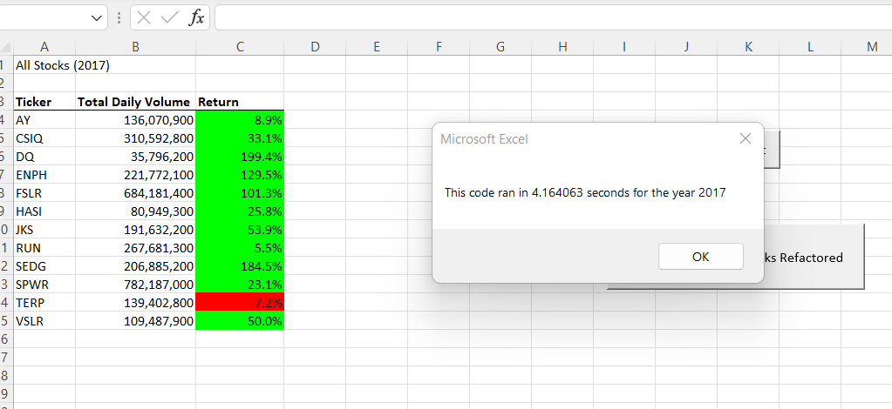
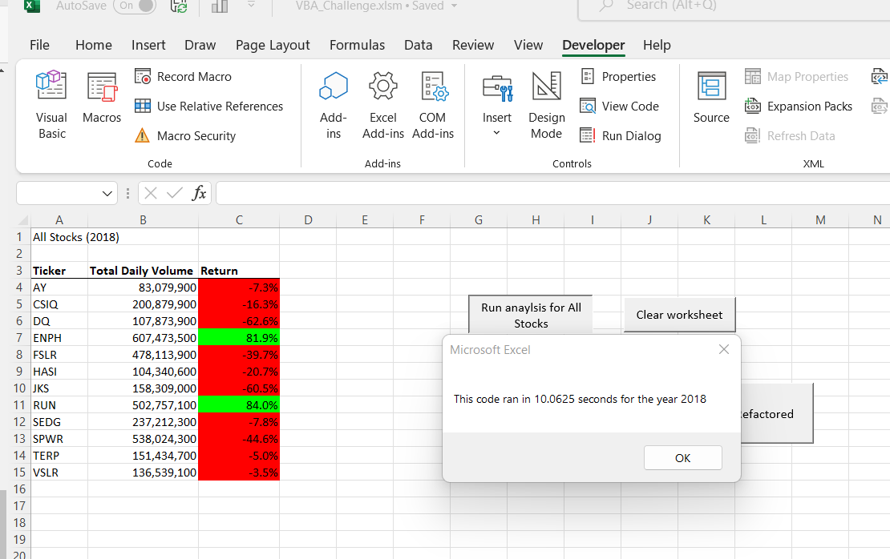
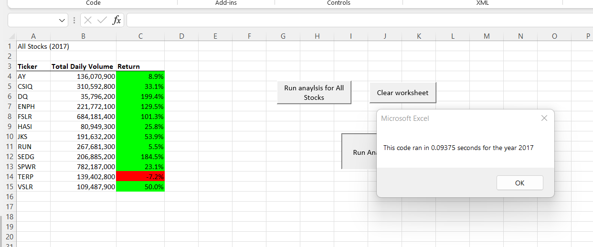
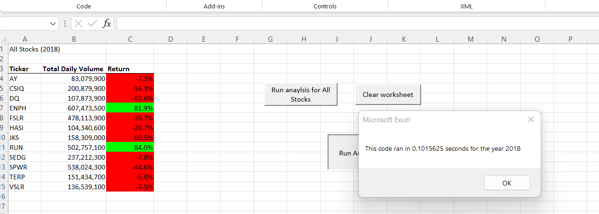

# Stock Analysis

## Performing a Stock analysis for Steve and his parents to help them decide which stock is the best option for them to invest in 

### Steve might want to know the yearly return for multiple stocks for multiple years later on. He wants to know how fast the VBA code will compile the results and how fast it takes for the code to execute and output in the code that was created

## Results

### these are the returns for 2017 and 2018 for under my orginal code, it took about 4 to 10 seconds for the code to perform the analysis 

### after refractoring my code, it took less than a second for the system to perform the analysis for both of the years and result the yearly return is the same

# Overall
VBA is a very helpful tool when it comes to performing what would had been very long manual and sometime very tedious tasks in excel, VBA codes can program the system to automate these tasks more accurately and much faster than a human could. Refactoring the code in excel can sometime even make the code and the program perform better. VBA sounds great it if the users are careful, it is very powerful; but it can be very dangerous. If the macro is enabled, hackers can abuse the system and rewrite the codes for malicious intense, like viruses and trojan horses. So all party would have to enable the Marco for anyone to edit the code. Also, Microsoft is always upgrading Excel so the codes might not work properly with older versions or with a future version of Excel.

Refactoring is a good idea to debug and make the existing code perform better without changing the overall purpose or output of the code, in many cases it makes the code easier to understand. But there are also many limitations to refactoring, just as refactoring can debug the code it could also introduce new bugs that was not there before. So then trying to fix that new bug might be a lot more work

